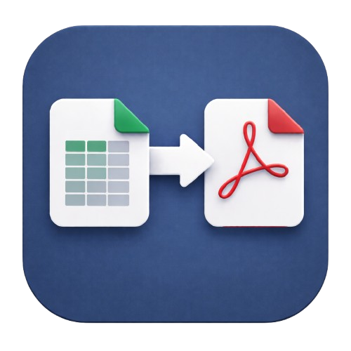

# Document Mapper

A desktop application for generating `.docx` documents from Excel data with explicit placeholder mapping and optional PDF export via LibreOffice.

<table>
  <tr>
    <td width="280" valign="top">
      
    </td>
    <td valign="top">
      <h2>Features</h2>
      <ul>
        <li><strong>Excel Data Mapping</strong>: Map Excel columns to DOCX template placeholders</li>
        <li><strong>Template Management</strong>: Create and manage document templates</li>
        <li><strong>PDF Export</strong>: Convert generated DOCX files to PDF using LibreOffice</li>
        <li><strong>Multi-language Support</strong>: Localization in multiple languages (English, German, Spanish, French, Italian, Russian)</li>
        <li><strong>Theme Support</strong>: Light and dark themes with automatic mode detection</li>
        <li><strong>Cross-platform</strong>: Built with PySide6 for Windows, macOS, and Linux</li>
        <li><strong>Configurable</strong>: TOML-based configuration for easy customization</li>
      </ul>
    </td>
  </tr>
</table>

## Available Languages

The app includes the following localized languages:

- English, Italian, German, Spanish, French, Russian

## Installation

### Prerequisites

- Python 3.10+
- LibreOffice (for PDF export functionality)

### Install Dependencies

```bash
pip install -r requirements.txt
```

For development, tests, and packaging:

```bash
pip install -r requirements-dev.txt
```

### Build UI Forms (if needed)

If you've modified any `.ui` files in `gui/forms/`, regenerate the Python form classes:

```bash
python scripts/build_ui.py
```

To rebuild specific forms:

```bash
python scripts/build_ui.py main_window mapping_page
```

## Usage

### Running the Application

```bash
python main.py
```

### Building Executable

Use PyInstaller to create a standalone executable:

```bash
pip install -r requirements-dev.txt
pyinstaller main.spec
```

Output artifact:

- Linux/macOS: `dist/document-mapper`
- Windows: `dist/document-mapper.exe`

## Configuration

The application uses `config.toml` for configuration. Key settings include:

- Application metadata (name, version, author)
- Window dimensions and theme preferences
- Resource paths for QSS styles, icons, and locales
- Logging configuration

## Project Structure

```
document-mapper/
├── core/                    # Core application logic
│   ├── config/             # Configuration management
│   ├── enums/              # Application enums
│   ├── manager/            # Managers (localization, themes)
│   ├── mapping/            # Document mapping services
│   ├── project/            # Project and document models
│   └── util/               # Utility functions
├── gui/                    # Graphical user interface
│   ├── controllers/        # UI controllers
│   ├── dialogs/            # Dialog windows
│   ├── forms/              # Qt Designer UI files
│   ├── styles/             # QSS stylesheets
│   ├── ui/                 # UI elements
│   └── windows/            # Main application windows
├── resources/              # Application resources
│   ├── icons/              # Application icons
│   ├── locales/            # Translation files
│   └── qss/                # Stylesheets
├── scripts/                # Build and utility scripts
├── tests/                  # Test suite
│   ├── core/               # Core logic tests
│   └── gui/                # GUI tests
├── config.toml             # Application configuration
├── main.py                 # Application entry point
├── main.spec               # PyInstaller specification
├── pytest.ini              # Pytest configuration
├── requirements.txt        # Runtime dependencies
└── requirements-dev.txt    # Dev/test/build dependencies
```

## Testing

This project uses `pytest` for testing. See [tests/README.md](tests/README.md) for detailed testing instructions.

Quick test run:

```bash
python -m pytest
```

For headless environments:

```bash
QT_QPA_PLATFORM=offscreen python -m pytest
```
### Building for Distribution
1. Keep runtime dependencies in `requirements.txt` only.
2. Keep build/test tooling (PyInstaller, pytest) in `requirements-dev.txt`.
3. Install dev tools: `pip install -r requirements-dev.txt`
4. Build executable: `pyinstaller main.spec`
